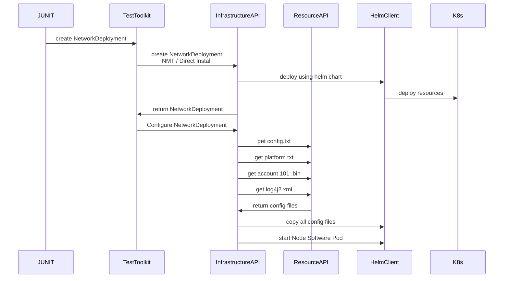

# 

## Creating a NetworkDeployment

```mermaid
sequenceDiagram

participant JUNIT
participant TestToolkit
participant InfrastructureAPI 
participant ResourceAPI
participant HelmClient
participant K8s


JUNIT ->> TestToolkit: create NetworkDeployment
TestToolkit ->> InfrastructureAPI: create NetworkDeployment <br/> NMT / Direct Install
InfrastructureAPI ->> HelmClient: deploy using helm chart
HelmClient ->> K8s: deploy resources
InfrastructureAPI ->> TestToolkit: return NetworkDeployment

TestToolkit ->> InfrastructureAPI: Configure NetworkDeployment
InfrastructureAPI ->> ResourceAPI: get config.txt
InfrastructureAPI ->> ResourceAPI: get platform.txt
InfrastructureAPI ->> ResourceAPI: get account 101 .bin
InfrastructureAPI ->> ResourceAPI: get log4j2.xml
ResourceAPI ->> InfrastructureAPI: return config files

InfrastructureAPI ->> HelmClient: copy all config files
InfrastructureAPI ->> HelmClient: start Node Software Pod
```