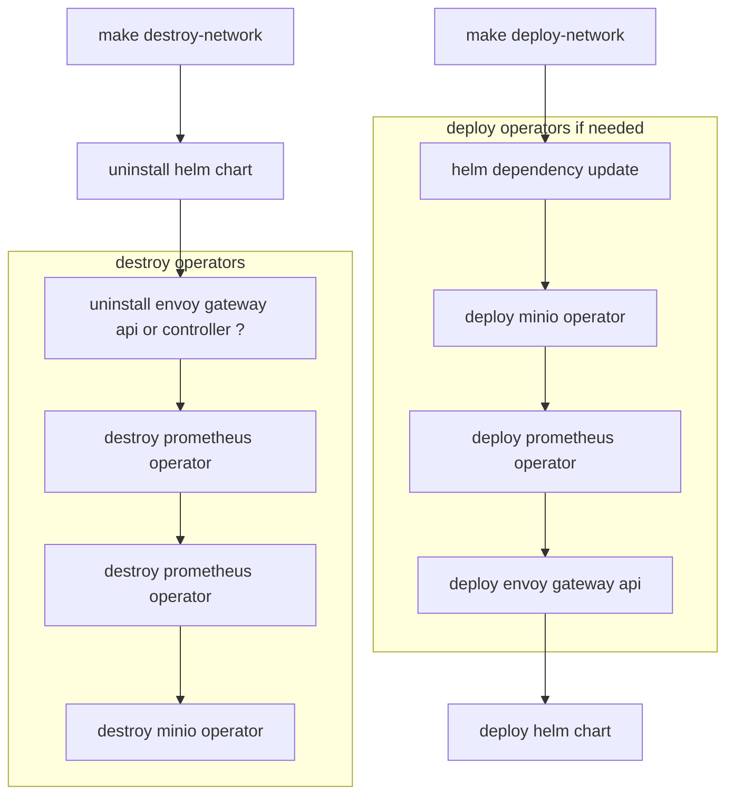
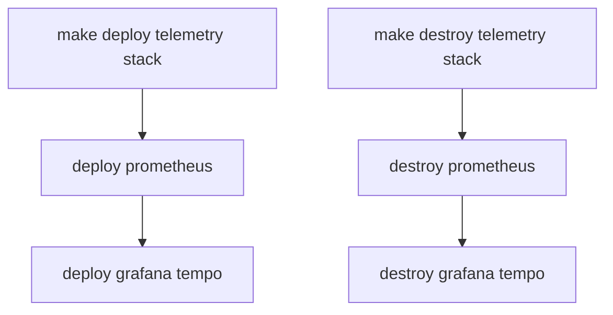

Make target sequence
Q) Will the plugin be used to setup the operators ?
Q) Will the java code be used to setup the operators ?

```mermaid
graph TD
    makedestroynetwork["make destroy-network"]
            --> B1[uninstall helm chart]
            --> B3[uninstall envoy gateway api or controller ?]
        subgraph destroy operators
            B3
            --> B4[destroy prometheus operator]
            --> B5[destroy prometheus operator]
            --> B6[destroy minio operator]
         end
            
    makedeploynetwork[make deploy-network]-->deploynetwork1
        subgraph deploy operators if needed
                        deploynetwork1[helm dependency update]
                        -->deploynetwork2[deploy minio operator]
                        -->deploynetwork3[deploy prometheus operator]
                        -->deploynetwork4[deploy envoy gateway api]
        end
                deploynetwork4-->deploynetwork5[deploy helm chart]
```

```mermaid
graph TD

    makedeploytelemetrystack["make deploy telemetry stack"]
        --> a1[deploy prometheus]
        --> a2[deploy grafana tempo]
        
    makedestroytelemetrystack["make destroy telemetry stack"]
        --> b1[destroy prometheus]
        --> b2[destroy grafana tempo]

```
